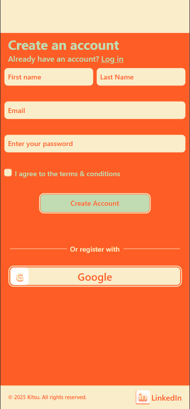
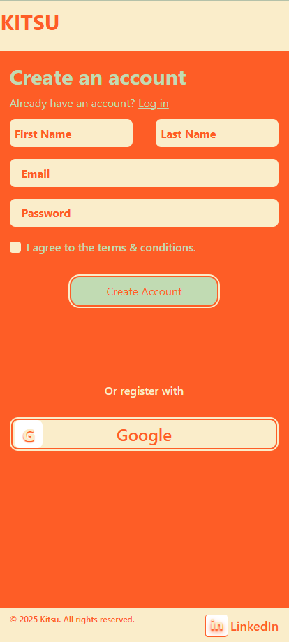
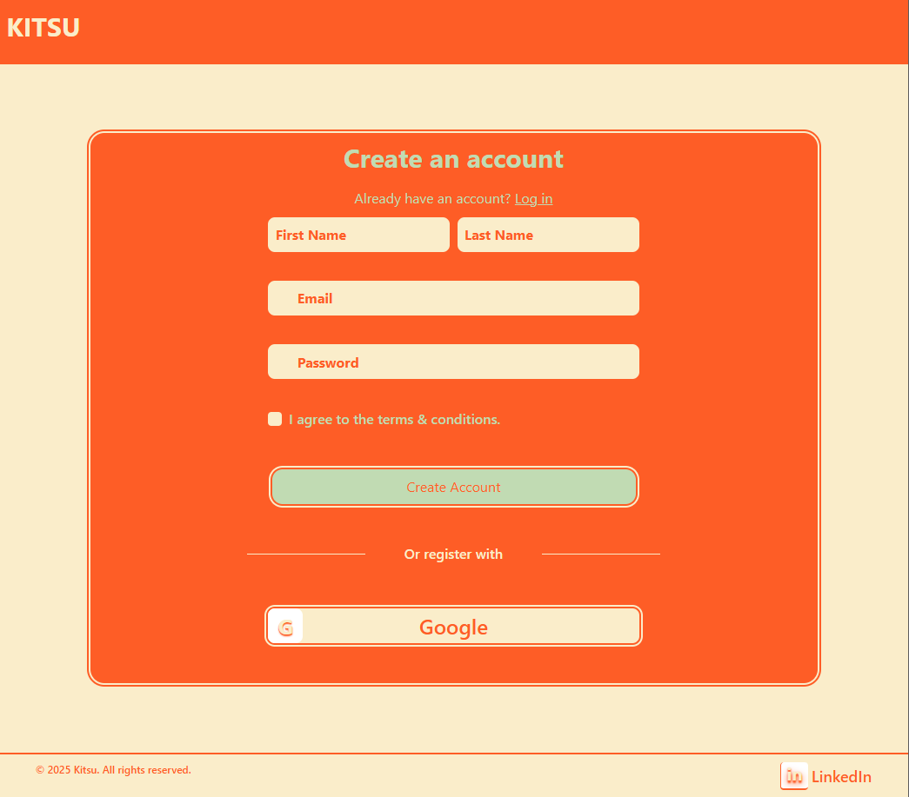
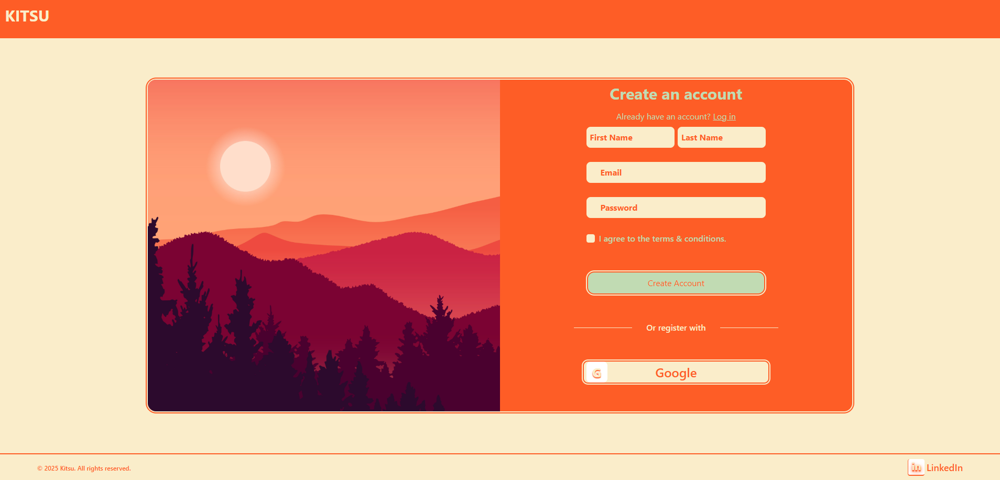

# Login Form - Responsive React App - Supabase

This is a fully responsive login form built with **React** and **Tailwind CSS**.  
The design adapts across different screen sizes:  
📱 `<420px` (mobile),  
📱 `<1024px` (tablet),  
💻 `>1024px` (desktop).

## 🚀 Features

- Responsive layout (mobile-first, 3 breakpoints)
- Clean and modular component structure
- Saving users on supabase
- Mobile & desktop login views
- Tailwind CSS for rapid styling
- Email/password input fields (ready for integration)
- Simple and production-ready design

## 📸 Screenshots

* Mobile Devices



* Web - Mobile



* Web - Tablet



* Web - Desktop



## 🛠️ Technologies

- React  
- Tailwind CSS  
- Responsive design principles

## 📂 Folder Structure

```
src/
├── components/
│ ├── SignupForm.jsx
│ ├── SignupForm.Mobile.jsx
│ └── SignupForm.Default.jsx
├── App.jsx
└── index.js
```

## ⚙️ Setup

1. Clone the repo  
   `git clone https://github.com/KitsuneTheDev/login-react`
2. Install dependencies  
   `npm install`
3. Start the development server  
   `npm run dev` or `npm start`

## ✨ Author

**Ozan Çelikkol**  
[GitHub](https://github.com/KitsuneTheDev) – [LinkedIn](https://www.linkedin.com/in/ozancelikkol)
